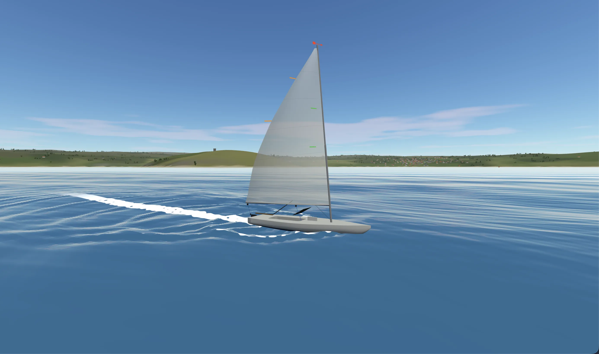

# [dinghysail.ing](https://dinghysail.ing)



A realistic-ish multiplayer dinghy sailing simulator based on scientific papers

## Play it

- Visit [`dinghysail.ing`](https://dinghysail.ing)
- How to sail
    - <kbd>A</kbd> and <kbd>D</kbd> for rudder
    - <kbd>W</kbd> and <kbd>S</kbd> for sail
    - Check telltales (strips of yarn) for how well the sail is trimmed
- How to check your position with no GPS
    - Press <kbd>F</kbd> to take bearings (directions) on objects around yourself
    - Take a bearing on the bow (nose)
    - Estimate the boat speed by pressing <kbd>F</kbd> on the wake (foam trail behind the boat)
    - Press <kbd>R</kbd> on the map and keep looking to **r**eckon your position and direction since the last mark (this plots your course!)

## How was this built

**With Anthropic and OpenAI models.** The game direction was decided by me and built layer by layer

## Netcode

Both the client and the server run simulations of physics, client for instant feel and server for consistency and authority. Physics clock ticks 60 times a second, and the client sends the inputs 60 times a second (so there's a tick system going on). The browser then corrects the boat position towards the authoritative state sent by the server, so it's a version of client-side prediction, just without the rewind

## What it's based on

Where each number for the physics simulation came from is noted in the `sources` blocks of the files in `data/`, and [docs/INDEX.md](docs/INDEX.md) says which paper and page feeds which part of the model:

- A. H. Day (2017), *Performance prediction for sailing dinghies*, Ocean Engineering 136: sail coefficients, foil and hull forces, heel and righting moment, and measured Laser data to compare against
- Larsson & Eliasson, *Principles of Yacht Design*: hull resistance and stability
- Keuning & Katgert, bare hull residuary resistance from the Delft Systematic Yacht Hull Series: the wave-making part of the hull drag
- ILCA class rules: mast, boom, sail, daggerboard and rudder dimensions
- ORC VPP documentation (2023): the effective sail span
- Gerstner waves, from GPU Gems chapter 1 (*Effective Water Simulation from Physical Models*), and the Kelvin wake pattern for the boat's wake
- Preetham et al.'s daylight model for the sky, through the Sky example in three.js

The dimensions for the dinghy are listed in `data/laser.json`. Anything that's estimated is marked `TUNING GUESS` or `VISUAL ESTIMATE`

The papers and class rules are copyrighted, so the PDFs are not in this repo. You can find them by title. `docs/INDEX.md` lists the pages the model uses

## Run it yourself

You need Node (CI uses 24), and Go (version in `go.mod`) if you want the server

```sh
npm install
npm run dev        # http://localhost:5173, simulates everything in your browser, no server needed
```

To play against the server, as the public site does:

```sh
npm run server     # Go server on :8080
```

then open `http://localhost:5173/?server=ws://localhost:8080/ws`. To run it like production, with the built site and the server on one port:

```sh
npm run build
go run ./server/cmd/sailserver -static dist    # http://localhost:8080 joins the server by itself; add ?offline to sail locally
```

Press <kbd>F3</kbd> or <kbd>~</kbd> for the debug panel (wind, waves, forces, physics switches)

Tests and tools:

```sh
npm test                     # TypeScript tests
go test ./server/...         # Go tests, including a check against the TypeScript physics
npm run polar                # headless polar diagram of the boat
npm run golden               # regenerate the reference traces the Go tests compare against; run after changing physics
npm run chart                # browserless export of the actual paper chart to polar-out/chart.png
npm run map                  # separate top-down terrain overview
```

The chart export uses a native canvas and the same renderer as the game, including its fonts and
symbols (font availability depends on your system). Use `npm run chart -- --out my-chart.png`,
add `--map-only` to crop the map panel, or `--zoom 2` to resize the output.

Use `./server/...` for Go, not `./...`, because `node_modules` contains a stray Go file. The design notes are in [docs/DESIGN.md](docs/DESIGN.md), the physics model in [docs/PHYSICS.md](docs/PHYSICS.md) and hosting in [docs/DEPLOY.md](docs/DEPLOY.md)

## Credits

- [three.js](https://threejs.org) (MIT) for rendering, and its Sky example, which the sky is adapted from
- [coder/websocket](https://github.com/coder/websocket) (ISC) for the Go server's WebSocket
- Vite, Vitest, TypeScript and ESLint for the tooling
- The papers and class rules listed above, and the authors who wrote them
- Hosted from a home server through a Cloudflare Tunnel

Not affiliated with or endorsed by ILCA. "Laser" and "ILCA" are used only to name the boat class

## License

MIT, see [LICENSE](LICENSE)
